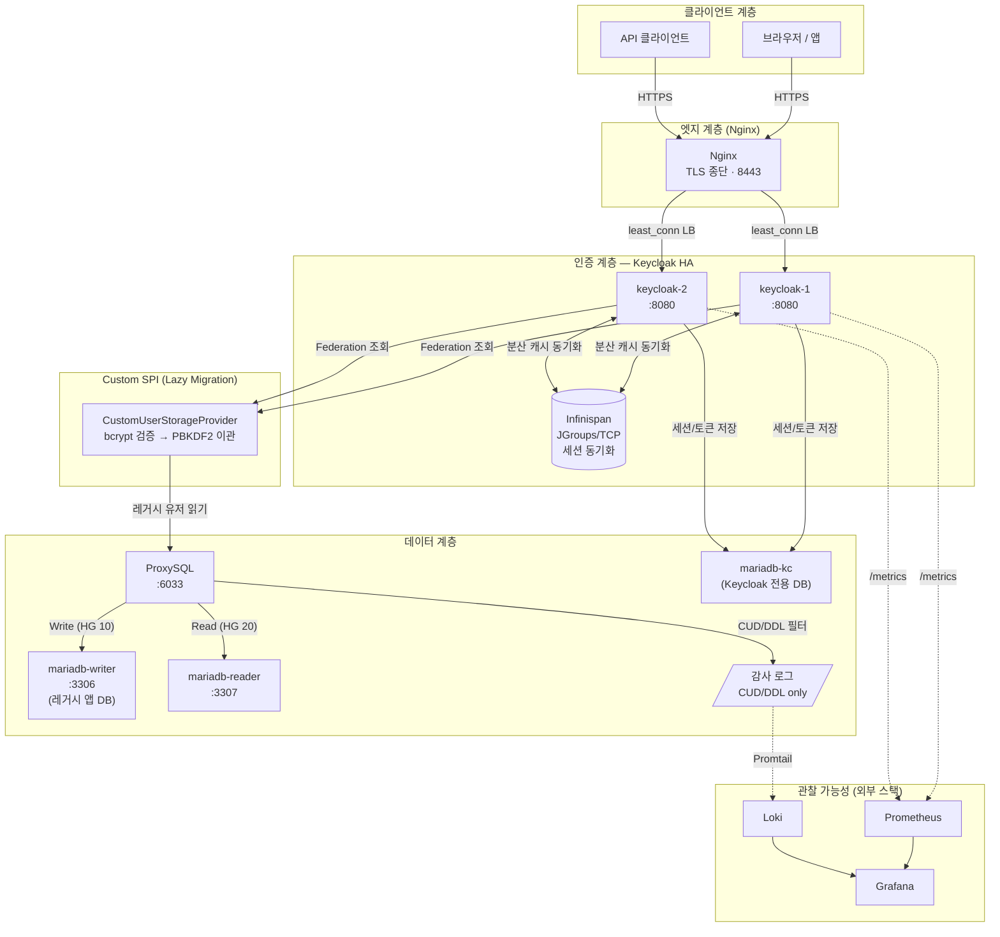
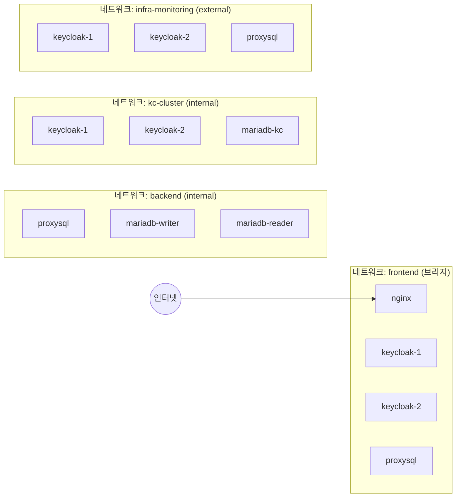
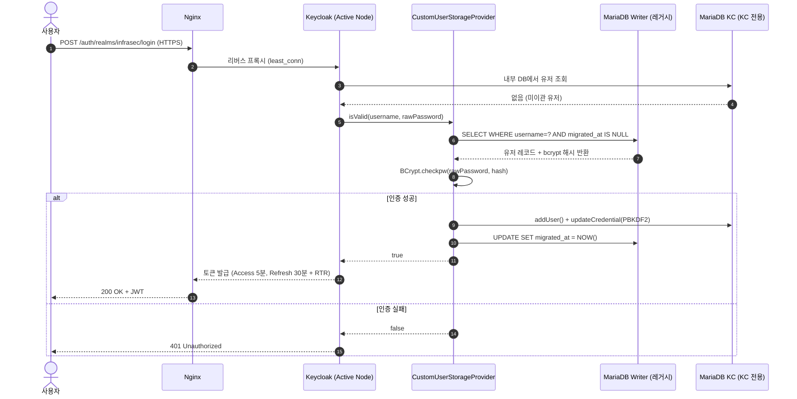
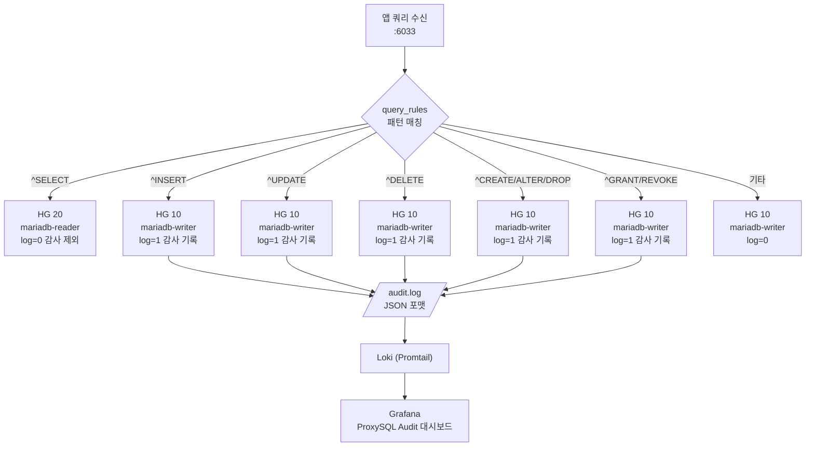
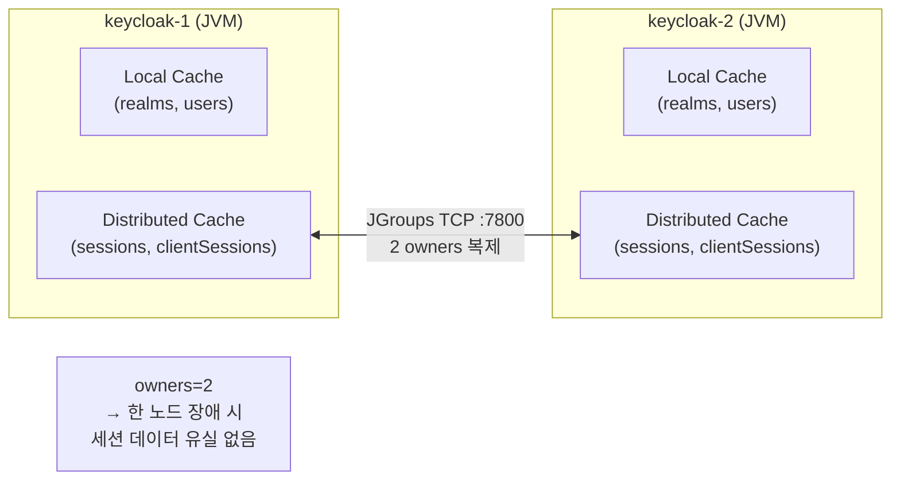

# 아키텍처 설계

## 전체 구성 개요

---

## 네트워크 격리 구조

> **설계 원칙**: `backend`, `kc-cluster` 네트워크는 `internal: true` → 외부 직접 접근 불가.  
> Keycloak과 ProxySQL은 `infra-monitoring` 외부 네트워크에도 참여해 Prometheus 스크랩을 허용한다.

---

## 요청 흐름 — 로그인 시퀀스 (Lazy Migration 포함)

---

## ProxySQL 쿼리 라우팅 흐름

---

## Infinispan 세션 동기화 구조

> **핵심**: `owners=2` 설정으로 양 노드에 세션 복제본 유지.  
> keycloak-1 장애 시 keycloak-2가 즉시 서비스 계속 가능.
