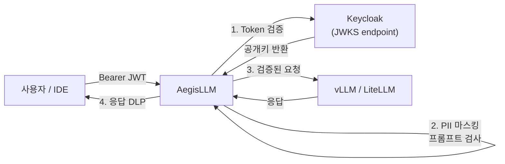
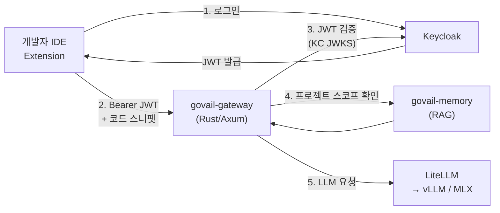
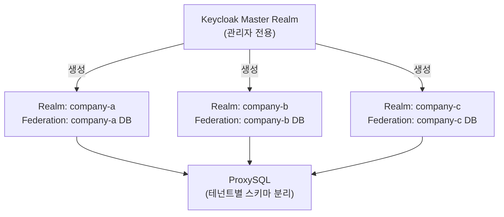
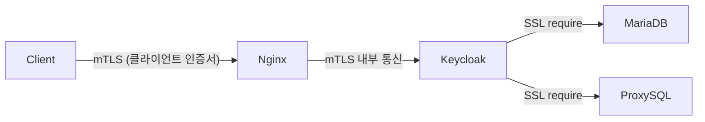

# 확장 아이디어 및 연동 시나리오

## 현재 스택

```
[사용자] → [Nginx] → [Keycloak HA] → [ProxySQL → MariaDB]
```

이 구조는 독립적으로 동작하지만, 주변 시스템과 연동하면 훨씬 강력해집니다.

---

## 시나리오 1 — AegisLLM 연동 (LLM API 보안 계층)

> **AegisLLM**: Rust/Axum 기반 LLM API 보안 게이트웨이.  
> 프롬프트 인젝션 탐지, PII 마스킹, API Key 인증, 감사 로그를 수행합니다.

### 연동 구조



### 연동 포인트

**Keycloak → AegisLLM 토큰 검증**:
```toml
# aegis-llm/configs/gateway.toml
[auth]
mode = "jwt"
jwks_uri = "https://<KC_HOST>/auth/realms/infrasec/protocol/openid-connect/certs"
required_claims = ["sub", "realm_access"]

# 역할 기반 LLM 접근 제어
[auth.role_policy]
"realm_access.roles" = ["llm-user", "llm-admin"]
```

**KC 토큰에 커스텀 클레임 추가** (Mapper 설정):
```
Keycloak Client Scope → Mapper:
  - department → JWT claim
  - legacy_role → JWT claim
→ AegisLLM이 부서/역할 기반 모델 접근 제어에 활용
```

**효과**:
- 인증(Keycloak) + LLM 보안(AegisLLM)이 분리된 단일 책임 구조
- Keycloak에서 사용자 비활성화 → AegisLLM 토큰 자동 무효화 (짧은 Access Token TTL 5분)
- ProxySQL 감사 로그 + AegisLLM 감사 로그를 Loki에서 동일 대시보드로 통합

---

## 시나리오 2 — GoVail Gateway 연동

GoVail의 `govail-gateway`는 AI 코드 분석 플랫폼의 진입점입니다.



**연동 방법**:
- GoVail Realm을 `infrasec` Realm의 Identity Provider로 등록 (또는 별도 Realm)
- Federation으로 기존 사내 계정 연동
- 프로젝트 접근 권한을 KC Role로 관리

---

## 시나리오 3 — 멀티 테넌트 확장

현재는 단일 `infrasec` Realm. 고객사별 격리가 필요한 경우:



**ProxySQL 확장**:
- `mysql_query_rules`에 스키마명 기반 라우팅 추가
- 테넌트별 감사 로그 라벨(`tenant=company-a`) 분리

---

## 시나리오 4 — Zero-Trust 강화 (mTLS)

현재 구성은 Nginx에서 TLS 종단. 더 강화하려면:



**추가 구현**:
1. Nginx에 `ssl_verify_client on` 설정
2. 내부 CA로 서비스 간 클라이언트 인증서 발급
3. KC `sslMode=REQUIRED` + MariaDB `require_ssl=ON` 쌍 구성 (현재 SPI에 적용됨)

---

## 우선순위 권장

| 확장 시나리오 | 난이도 | 임팩트 |
|---|---|---|
| **AegisLLM 토큰 검증 연동** | ★★☆ | LLM 플랫폼 통합 인증 |
| **Grafana 통합 대시보드** | ★☆☆ | 운영 가시성 |
| **멀티 테넌트 Realm** | ★★★ | SaaS 전환 가능 |
| **서비스 간 mTLS** | ★★★ | Zero-Trust 완성 |
