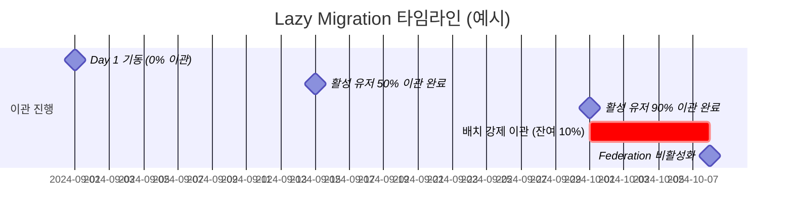

# Lazy Migration 전략

> 다운타임 없는 점진적 유저 이관 — Custom User Storage SPI 기반

---

## 왜 Lazy Migration인가

기존 레거시 시스템에서 Keycloak으로 전환할 때 두 가지 선택지가 있습니다.

| 방식 | 방법 | 문제 |
|---|---|---|
| **Big-bang 이관** | 모든 유저를 일괄 배치로 이관 | 패스워드 평문 접근 불가 → 비밀번호 초기화 강요, 사용자 경험 저하 |
| **Lazy Migration** | 로그인 시 자동 이관 | 다운타임 없음, 비밀번호 초기화 없음 |

이 프로젝트는 **Lazy Migration**을 채택합니다.

---

## 이관 흐름

```mermaid
flowchart TD
    A([사용자 로그인 시도]) --> B{KC 내부 DB\n유저 존재?}

    B -->|Yes — 이관 완료| C[KC 내부 PBKDF2 검증]
    C --> D([로그인 성공])

    B -->|No — 미이관| E[CustomUserStorageProvider\n레거시 DB 조회]
    E --> F{migrated_at\nIS NULL?}

    F -->|NULL — 미이관| G[BCrypt 검증\nlegacy password_hash]
    F -->|NOT NULL — 이미 이관| Z([유저 없음 처리])

    G --> H{검증 성공?}

    H -->|No| Y([로그인 실패])

    H -->|Yes| I[KC 내부 DB에\naddUser + PBKDF2 저장]
    I --> J[레거시 DB\nmigrated_at = NOW()]
    J --> K{이관 성공?}

    K -->|Yes| D
    K -->|No — DB 장애 등| L["이관 실패 로그\n[MIGRATION] 유저 이관 실패"]
    L --> D2([로그인은 허용\n다음 로그인에 재시도])
```

---

## 상태 추적

레거시 DB의 `users.migrated_at` 컬럼으로 이관 상태를 추적합니다.

```sql
-- 이관 현황 조회
SELECT
  COUNT(*)                                                      AS 전체,
  SUM(CASE WHEN migrated_at IS NOT NULL THEN 1 ELSE 0 END)     AS 이관완료,
  SUM(CASE WHEN migrated_at IS NULL     THEN 1 ELSE 0 END)     AS 미이관,
  ROUND(
    SUM(CASE WHEN migrated_at IS NOT NULL THEN 1 ELSE 0 END)
    / COUNT(*) * 100, 1
  )                                                             AS 이관율_pct
FROM users
WHERE is_active = 1;
```

```bash
# 스크립트로 실행
make migration-status
```

---

## 이관 완료 판단 기준



일반적으로 활성 유저의 90%는 30일 내 자연 로그인으로 이관됩니다.  
잔여 비활성/휴면 유저는 별도 배치로 처리하거나 계정 만료 처리합니다.

---

## 전환 완료 체크리스트

- [ ] 레거시 DB `migrated_at IS NULL AND is_active = 1` 레코드 = 0
- [ ] Keycloak Federation Provider 비활성화
- [ ] 레거시 DB `kc_reader` 계정 권한 회수
- [ ] ProxySQL → 레거시 DB 연결 제거 (SPI 경유 읽기 종료)
- [ ] Grafana 마이그레이션 대시보드 100% 확인

---

## 배치 강제 이관 (선택)

휴면 유저 등 자연 로그인이 발생하지 않는 유저를 강제 이관합니다.  
패스워드 재설정 이메일 발송과 함께 처리하는 것을 권장합니다.

```bash
# 미이관 유저 수 확인
mysql -h 127.0.0.1 -P 6033 -u appuser -p appdb \
  -e "SELECT COUNT(*) FROM users WHERE migrated_at IS NULL AND is_active=1;"

# Keycloak Admin API로 패스워드 재설정 이메일 발송
./scripts/batch-reset-password.sh   # 추후 구현
```
