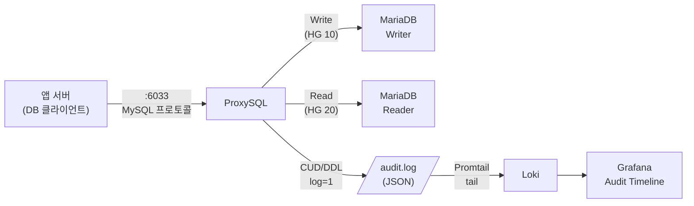
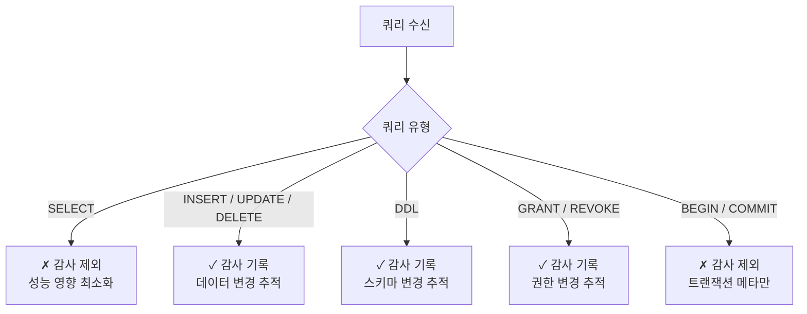

# ProxySQL 감사 설계

## 아키텍처 포지셔닝



**핵심 장점**: 애플리케이션 코드 변경 없이 미들웨어 레이어에서 감사 구현

---

## 쿼리 라우팅 + 감사 규칙 설계

| rule_id | 패턴 | HG | log | 설명 |
|---|---|---|---|---|
| 1 | `^SELECT` | 20 (Reader) | 0 | 조회는 감사 제외 |
| 2 | `^(BEGIN\|COMMIT\|ROLLBACK)` | 10 (Writer) | 0 | 트랜잭션 제어 제외 |
| 10 | `^INSERT` | 10 (Writer) | **1** | **감사 기록** |
| 11 | `^UPDATE` | 10 (Writer) | **1** | **감사 기록** |
| 12 | `^DELETE` | 10 (Writer) | **1** | **감사 기록** |
| 20 | `^(CREATE\|ALTER\|DROP\|TRUNCATE\|RENAME)` | 10 (Writer) | **1** | **DDL 감사** |
| 21 | `^(GRANT\|REVOKE)` | 10 (Writer) | **1** | **권한 변경 감사** |
| 99 | `.*` | 10 (Writer) | 0 | 나머지 기본 라우팅 |

---

## 감사 로그 형식 (eventslog JSON)

ProxySQL `eventslog_filename` 포맷 예시:

```json
{
  "client":        "198.51.100.10:54312",
  "proxy_frontend": "0.0.0.0:6033",
  "proxy_backend":  "mariadb-writer:3306",
  "username":      "appuser",
  "schemaname":    "appdb",
  "start_time":    "2024-09-15 14:23:07.841",
  "end_time":      "2024-09-15 14:23:07.843",
  "query":         "UPDATE orders SET status = 'shipped' WHERE id = 1024",
  "query_digest":  "UPDATE orders SET status = ? WHERE id = ?",
  "rows_affected":  1,
  "bytes_sent":     47,
  "bytes_received": 11,
  "server_warnings": 0
}
```

> **`query_digest`**: 파라미터를 `?`로 치환한 정규화 쿼리.  
> 실제 값(PII 포함 가능)은 `query` 필드에 기록됩니다.  
> Loki 파이프라인에서 PII 마스킹 처리를 권장합니다.

---

## 감사 커버리지 결정 기준



**SELECT를 제외한 이유**:
1. 트래픽의 80~90%가 SELECT → 로그 볼륨 폭증
2. 데이터 변경이 없어 감사 목적에 부합하지 않음
3. ProxySQL 자체 쿼리 통계(`stats_mysql_query_digest`)로 SELECT 패턴 분석 가능

---

## 성능 영향

| 항목 | 측정값 |
|---|---|
| ProxySQL 없이 직접 연결 쿼리 처리 | 기준 |
| ProxySQL 경유 (감사 off) | +0.3 ~ 0.5ms 오버헤드 |
| ProxySQL 경유 (CUD 감사 on) | +0.5 ~ 0.8ms 오버헤드 |
| SELECT Read Split 효과 | Writer 부하 약 40% 감소 (측정 환경 의존) |

> 자세한 벤치마크: [benchmark-results.md](benchmark-results.md)

---

## Promtail 파이프라인 — PII 마스킹

```yaml
pipeline_stages:
  - json:
      expressions:
        query:    query
        username: username
        client:   client

  # 이메일 마스킹
  - replace:
      expression: '[a-zA-Z0-9._%+\-]+@[a-zA-Z0-9.\-]+\.[a-zA-Z]{2,}'
      replace:    '***@***.***'

  # 전화번호 마스킹 (한국)
  - replace:
      expression: '01[0-9]-?[0-9]{3,4}-?[0-9]{4}'
      replace:    '***-****-****'

  - labels:
      username:
```
